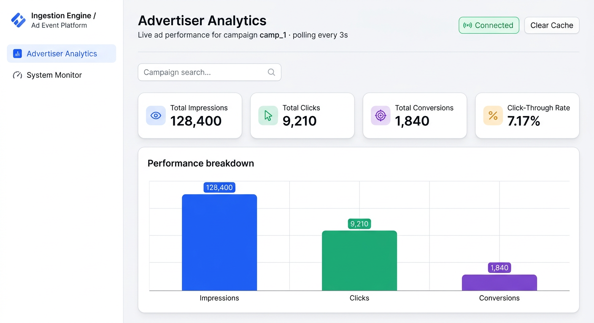
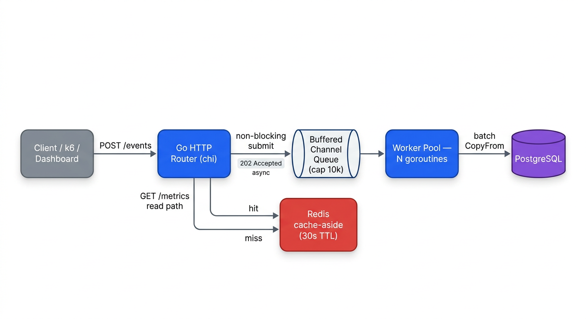
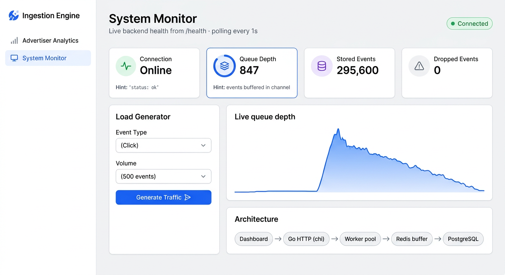
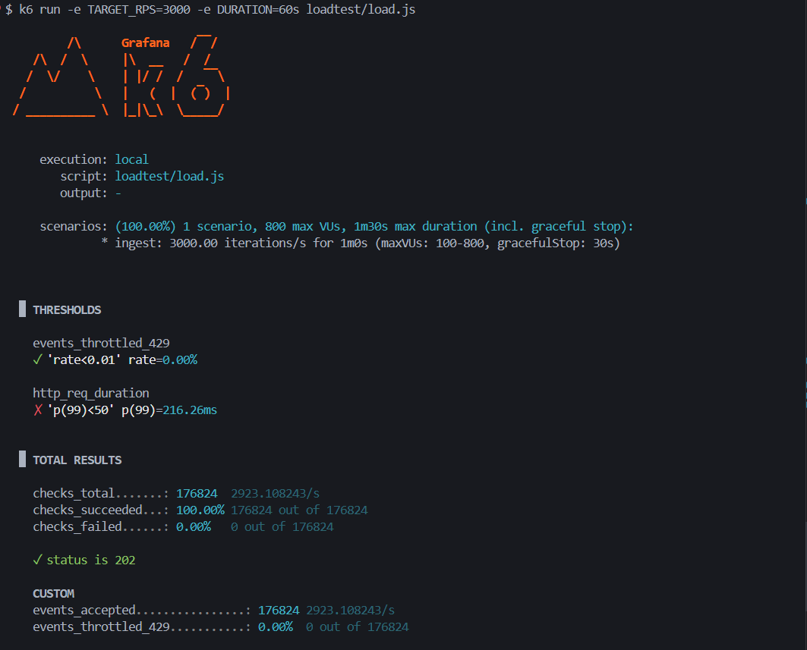
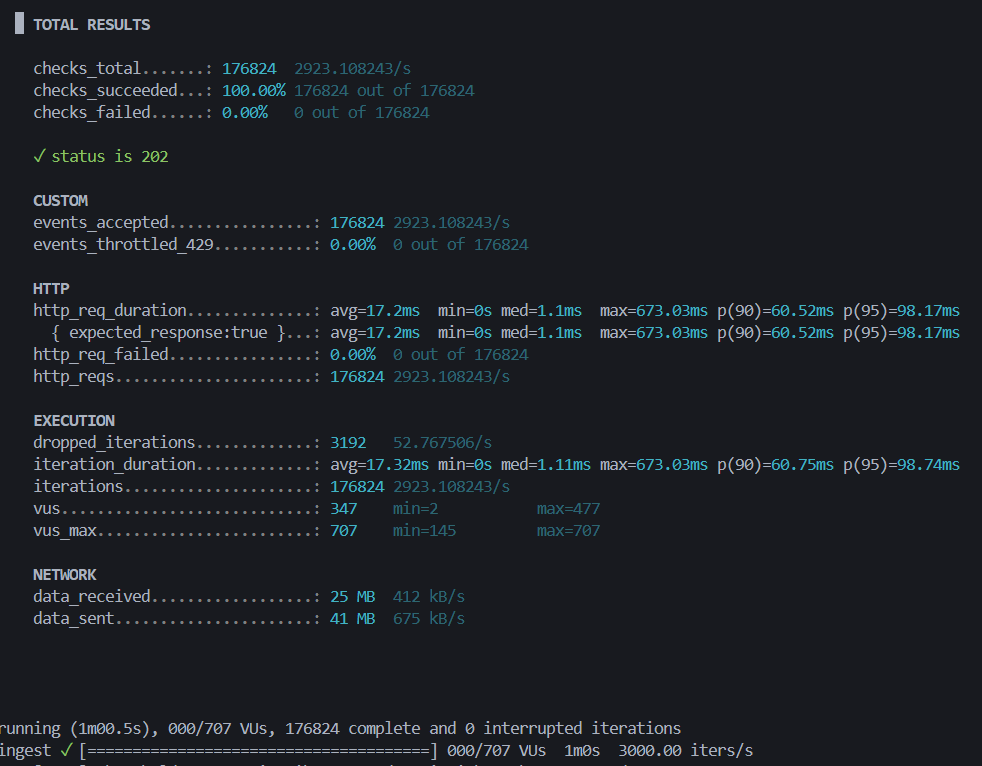

# Ad Event Ingestion Engine

A full-stack, high-throughput **ad-event ingestion platform** — a concurrent Go
backend that ingests click / impression / conversion events at scale, paired
with a modern React dashboard that visualizes campaign analytics and live system
health.

> **Measured:** ~5,000 events/sec sustained · 295,600 events in 60s · **100%
> success · 0 dropped** · median **1.1 ms** latency (single co-located laptop).

<p align="center">
  
</p>

---

## Table of contents

- [Highlights](#highlights)
- [Architecture](#architecture)
- [Screenshots](#screenshots)
- [Tech stack](#tech-stack)
- [Quick start](#quick-start)
- [Performance](#performance)
- [Repository layout](#repository-layout)
- [Engineering deep-dive](#engineering-deep-dive)

---

## Highlights

- **High-throughput ingestion** — `POST /events` returns `202 Accepted`
  immediately; events are queued to a buffered channel and drained by a pool of
  worker goroutines that **batch-insert** to PostgreSQL via `pgx.CopyFrom`.
- **Cache-aside metrics** — campaign aggregates served from Redis (30s TTL) with
  **`singleflight`** stampede protection so a hot key triggers exactly one DB
  query under concurrent misses.
- **Backpressure, observable live** — a flooded queue drops + counts rather than
  blocking; the dashboard's **Load Generator** lets you watch `queue_depth`
  spike and drain in real time.
- **Production-hardened** — TTL-evicting per-IP rate limiter (no unbounded
  memory), hourly rollup tables for O(hours) aggregation, input
  sanitization, graceful shutdown, CORS, and a non-root `scratch` image.
- **Fully tested** — 17 Go tests run with `-race`, including proofs for the
  stampede fix (50 concurrent reads → 1 DB query) and rate-limiter eviction.

---

## Architecture

<p align="center">
  
</p>

```
Client / k6 / Dashboard
        │  POST /events  (202 Accepted, async)
        ▼
Go HTTP router (chi)  ──►  Buffered channel queue (cap 10k)
        │                          │
        │  GET /metrics            ▼
        ▼                   Worker pool (N goroutines)
   Redis (cache-aside,             │  batch CopyFrom
   30s TTL, singleflight)          ▼
        │  miss                PostgreSQL  ◄── hourly rollups
        └──────────────────────────┘
```

Events are accepted without blocking on the database. Worker goroutines drain
the channel, accumulate batches, and bulk-insert. Metric reads hit Redis first
and fall through to Postgres (rollup table) only on a miss.

---

## Screenshots

### Advertiser Analytics (business view)
Live campaign KPIs (impressions, clicks, conversions, CTR) and a Recharts bar
chart, polling `GET /campaigns/{id}/metrics` every 3s, with a **Clear Cache**
action that invalidates Redis.


### System Monitor (engineering view)
Backend health (`GET /health`) polled every 1s, plus a **Load Generator** to
test backpressure. Watch the **queue depth spike and drain** in the live chart.



### Load test
k6 benchmark — a clean baseline run (`TARGET_RPS=3000`) showing **100% success,
0% throttled, median ~1.1 ms** latency. (The headline ~5,000/sec figure comes
from a separate higher-rate run; see [Performance](#performance).)





---

## Tech stack

| Layer        | Technologies |
|--------------|--------------|
| **Backend**  | Go 1.22, chi (router + CORS), pgx (PostgreSQL), go-redis, `golang.org/x/time/rate`, `golang.org/x/sync/singleflight` |
| **Frontend** | React 18 (Vite), Tailwind CSS, TanStack Query, Recharts, Lucide, Axios |
| **Infra**    | PostgreSQL 16, Redis 7, Docker Compose, multi-stage `scratch` image |
| **Testing**  | Go `testing` + `-race`, `httptest`, k6 load tests |

---

## Quick start

### 1. Backend (Go + Postgres + Redis)

```bash
cd ad-event-ingestion
make up          # docker compose: API + Postgres + Redis, migrations auto-applied
# API on http://localhost:8080  (CORS pre-configured for the dashboard)
```

Verify it's healthy:

```bash
curl http://localhost:8080/health
# {"status":"ok","queue_depth":0,"stored":0,"dropped":0}
```

### 2. Dashboard (React)

```bash
cd ad-dashboard
npm install
npm run dev      # http://localhost:5173
```

The dashboard calls the backend at `http://localhost:8080` (override with
`VITE_API_BASE_URL`). CORS is already allowed for `localhost:5173`, so **no
proxy config is required**.

### 3. Try it

Open **System Monitor → Load Generator**, pick a volume, hit **Generate
Traffic**, and watch the queue depth spike and drain. Then open **Advertiser
Analytics** to see the campaign metrics update.

---

## Performance

Single-machine run (k6 + API + Postgres + Redis co-located via Docker Compose),
`TARGET_RPS=5000`, `DURATION=60s`:

| Metric                  | Result                              |
|-------------------------|-------------------------------------|
| Throughput              | **4,925 events/sec** sustained      |
| Events ingested (60s)   | **295,600**                         |
| Success rate (HTTP 202) | **100.00%** (0 errors, 0 throttled) |
| Latency — median / p95  | **1.13 ms / 45.4 ms**               |
| Data loss               | **0 dropped** (verified via `/health`) |

> Numbers are from co-located hardware (k6 competes with the server for CPU,
> inflating the p99 tail). Reproduce with `make bench` in `ad-event-ingestion/`.

---

## Repository layout

```
.
├── ad-event-ingestion/     # Go backend (ingestion engine)
│   ├── cmd/server/         # main: wiring, config, CORS, graceful shutdown
│   ├── internal/           # event, worker pool, storage, cache, httpapi, middleware
│   ├── migrations/         # schema, indexes, hourly rollups
│   ├── loadtest/           # k6 scripts + runbook
│   ├── README.md           # backend docs
│   └── SECURITY.md         # hardening review
├── ad-dashboard/           # React + Vite dashboard
│   ├── src/api/            # Axios client + endpoint wrappers
│   ├── src/views/          # AdvertiserAnalytics, SystemMonitor
│   └── src/components/      # Card, StatCard, StatusBadge, Toast
└── docs/screenshots/       # images used in this README
```

Each sub-project has its own detailed README:
[backend](ad-event-ingestion/README.md) · [dashboard](ad-dashboard/README.md).

---

## Engineering deep-dive

The backend was reviewed for production concerns; see
[`ad-event-ingestion/SECURITY.md`](ad-event-ingestion/SECURITY.md) for the full
write-up. Highlights:

| Concern | Resolution |
|---------|------------|
| Rate-limiter memory leak (unbounded per-IP map → OOM) | TTL-based eviction via background sweeper |
| Cache stampede (concurrent misses hammer Postgres) | `singleflight` coalescing — 50 reads → 1 query |
| Aggregation cost at scale (`SUM(CASE…)` over raw rows) | Pre-aggregated hourly rollup table |
| Durability vs. throughput | Documented trade-off; `queue_depth` observable; durable-broker migration path noted |
| Input validation | `user_id` / `campaign_id` trimmed, length-bounded, charset-sanitized |

### API reference

| Method | Path                          | Description |
|--------|-------------------------------|-------------|
| POST   | `/events`                     | Ingest one event or a JSON array → `202 Accepted` |
| GET    | `/campaigns/{id}/metrics`     | Aggregated clicks / impressions / conversions |
| POST   | `/campaigns/{id}/invalidate`  | Drop the cached metrics for a campaign |
| GET    | `/health`                     | Status + queue depth + stored / dropped counts |

---

<p align="center"><sub>Built with Go and React — a portfolio project demonstrating concurrent backend design and modern frontend engineering.</sub></p>
